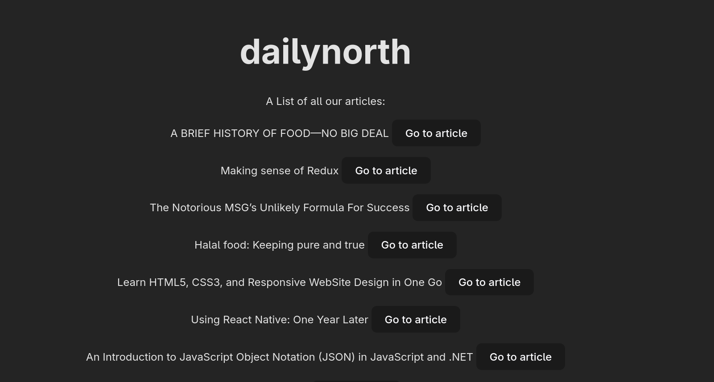

dailynorth is a news website covering topics from technology, sport, media and culture. Users can add comments and upvote articles.

To run this project locally, type in the terminal:

git clone https://github.com/uzougochukwu/dailynorth

Then

cd dailynorth

npm install

npm run dev

Hold down the control key and click on the localhost link in the terminal.

link to api: https://news-api-h2gt.onrender.com/api